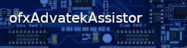

==================

OpenFrameworks addon to get data from and to [Advatek Pixel Controllers].

It has no UI, see ofxAdvatekAssistant for a UI build with ofxImGUI

How to Use
==========

    Advatek::Poll();

[Advatek Pixel Controllers]: https://www.advateklights.com/products/pixel-control
[ofxImGUI]: https://github.com/jvcleave/ofxImGui
